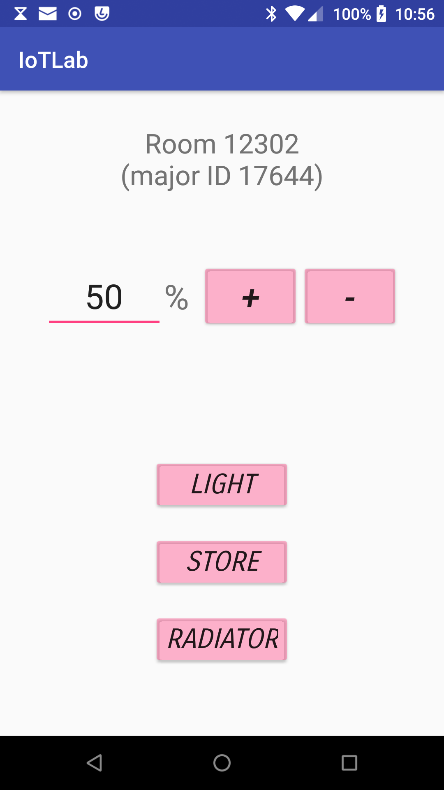

# Lab 3: BeaconsApp #

This is a template of a Java/Gradle-based Android application for controlling
an [Estimote BLE-based location](https://developer.estimote.com/) beacon
deployment. See also the [documentation for the Android
SDK](https://developer.estimote.com/indoor/android-tutorial/).

## Scenario ##

Several beacons are deployed, each in a virtual *room*: we want to locate
the closest one with respect to our control device, i.e. an Android-based
smartphone.

Each beacon is univocally identified by a pair: **major** and **minor**
numerical IDs.  Beacons come in pairs, each sharing the same major ID.

Our **goal** is to write code based on the [Fleet Management
API](https://github.com/Estimote/Android-SDK) to locate, *given a major ID*,
the beacon closest to us and show that ID on the app main screen (in lieu of
"RoomX"), as shown below (ignore all other widgets, they're not involved in
this exercise):

[Examples are available here.](https://github.com/Estimote/Android-Fleet-Management-SDK/blob/f62e6a838c09374e4eb0fd0b7d608e9e29efb4b8/Docs/DOC_monitoring_scanning.md)

Keep in mind that your app must be granted **access** to Android's *Location*
service, and, of course, Bluetooth must be on.

Other apps that might help you with BLE appliances are:

*  [official Estimote App](https://play.google.com/store/apps/details?id=com.estimote.apps.main)
*  [nRF Connect for Mobile](https://play.google.com/store/apps/details?id=no.nordicsemi.android.mcp)

## Installation ##

You need to install the following mandatory packages on your development
workstation (follow your GNU/Linux distribution's instructions -- package
names below are for Arch Linux):

  * Java Development Kit **v8** (avoid newer releases) of your choice, f.i.: `jdk-openjdk`
  * Build system for the JVM: `gradle`
  * Android SDK: `android-sdk`
  * Android platform tools: `android-tools`

and, *optionally*:

  * Official Android ID: `android-studio`
  * Google Android Emulator: `android-emulator`

In order to connect your Android device to your development workstation via
`adb`, you might need to install some auxiliary packages and/or tweak some
`udev` rules. In Arch Linux, [this done by the `android-udev`
package](https://wiki.archlinux.org/index.php/Android_Debug_Bridge).

### Configuration ###

Run this at your shell or put it in your `~/.bashrc` (change
`/path/to/your/sdk` with the real installation path -- `/opt/android-sdk` on
Arch Linux)

    ANDROID_SDK_ROOT=/path/to/your/sdk
    ANDROID_HOME=$ANDROID_SDK_ROOT
    PATH="${ANDROID_HOME}/tools/bin${PATH:+:${PATH}}"
    export ANDROID_SDK_ROOT ANDROID_HOME PATH

### Initialization ###

Accept the SDK licenses. If your SDK is user-installed, run

    $ yes | sdkmanager --licenses

else (system install)

    $ yes | sudo sdkmanager --licenses

If your SDK is installed system-wide, you need to manually install some
components -- else, you'll get errors like "The SDK directory is not writable
(/opt/android-sdk)":

    $ sudo sdkmanager --install "platforms;android-26" "build-tools;27.0.3" "platform-tools"

## Develop ##

The only file to be modified for this lab is

    app/src/main/java/com/example/iot_hes/iotlab/MainActivity.java

Please note, this is a symlink to `MainActivity.java.incomplete` -- **you
shouldn't** change it. In case of problems with that, rename
`MainActivity.java.incomplete` to `MainActivity.java`.

## Build the app  ##

Inside your project directory, run the following command:

    $ ./gradlew build

Results are in `app/build/outputs/apk/`. You can now install the *debug* version via the command:

    $ ./gradlew installDebug

Please note that, the *release* app [must be
signed](https://stackoverflow.com/questions/18328730/how-to-create-a-release-signed-apk-file-using-gradle). Then
you'll be able to install it with:

    $ adb install app/build/outputs/apk/release/app-release.apk

After any changes to the code, prior to rebuild, you better off to run:

    $ ./gradlew cleanBuildCache clean

then rebuild the app.

# Maintenance #

This section is for code maintainers. Students are however encouraged to read :-)

Most tasks are available via the included `Makefile`. See:

    $ make help
